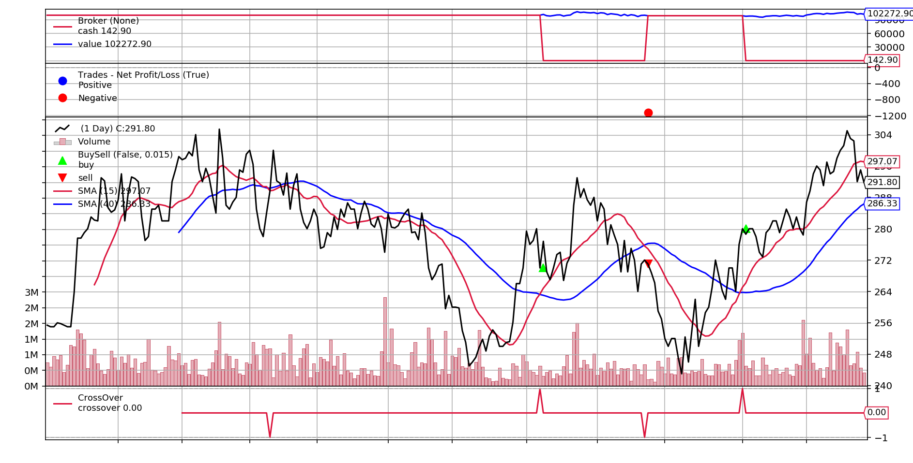
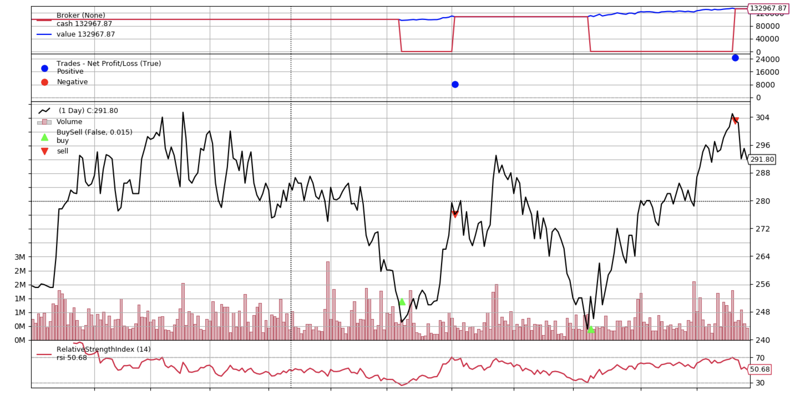
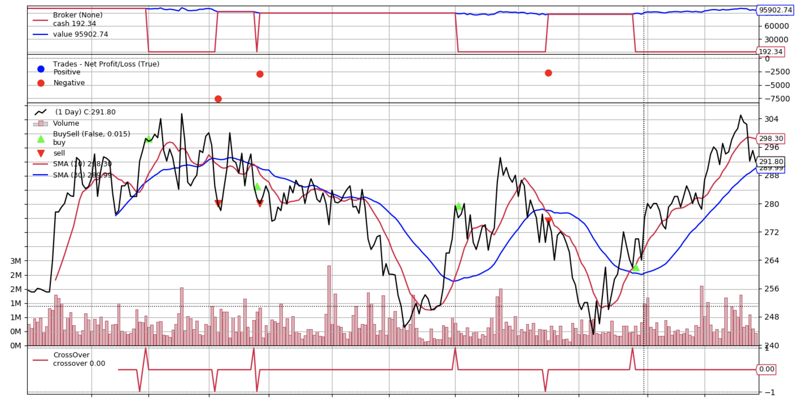
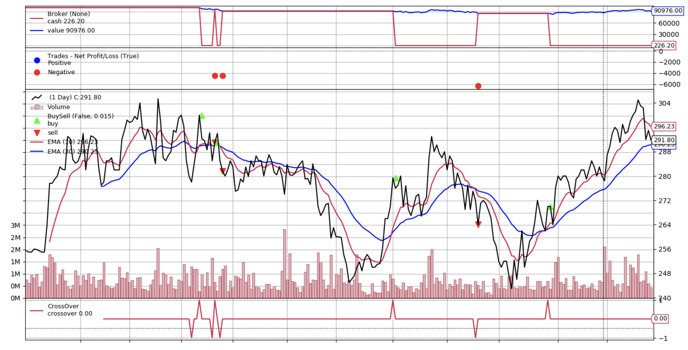
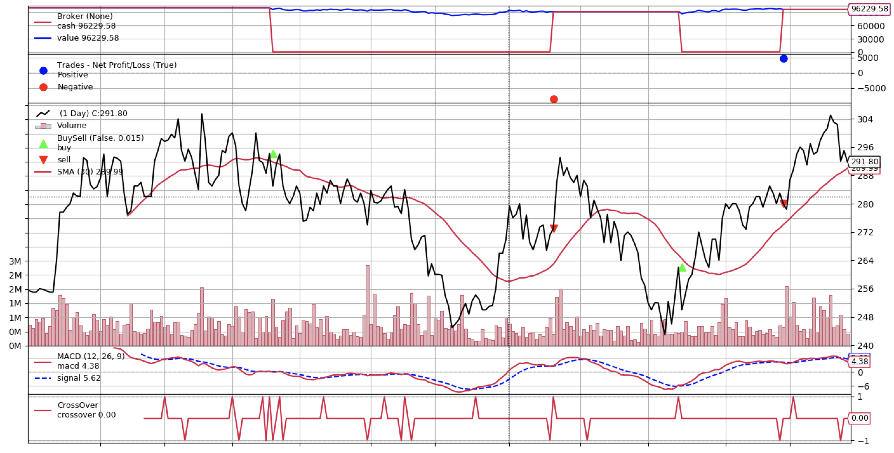
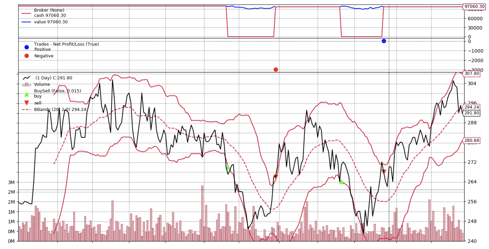
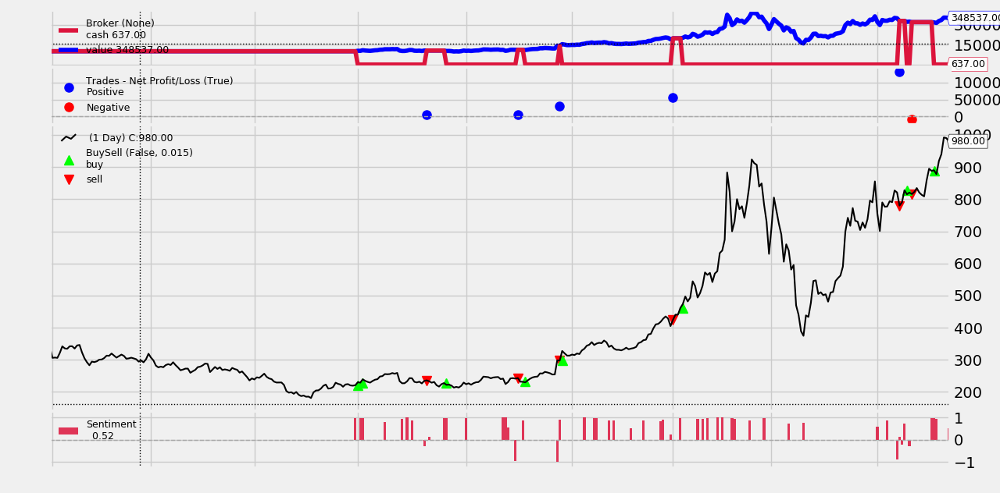
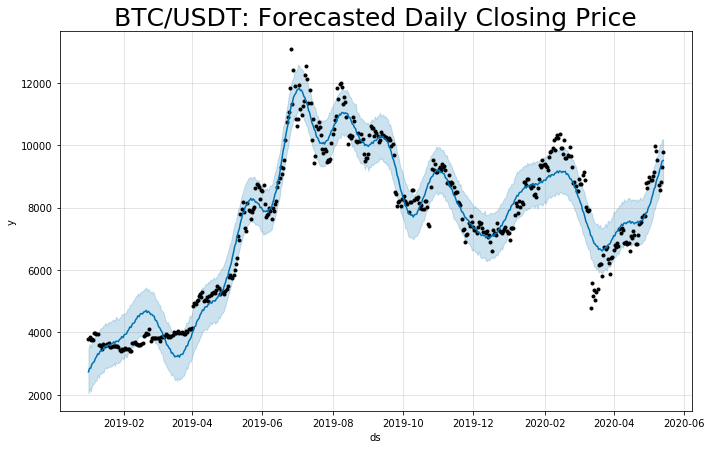
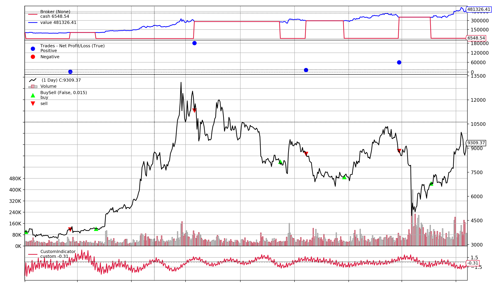

# fastquant :nerd_face:
[](https://travis-ci.com/enzoampil/fastquant)
[](https://github.com/ambv/black)
[](https://raw.githubusercontent.com/enzoampil/fastquant/master/LICENSE)
[](https://pepy.tech/project/fastquant)
## Bringing backtesting to the mainstream

**fastquant** allows you to easily backtest investment strategies with as few as 3 lines of python code. Its goal is to promote data driven investments by making quantitative analysis in finance accessible to everyone.

To do this type of analysis without coding, you can also try out [Hawksight](https://hawksight.co/), which was just recently launched! :smile:

If you want to interact with us directly, you can also reach us on the [Hawksight discord](https://discord.gg/BHMCw2C6VP). Feel free to ask about fastquant in the #feedback-suggestions and #bug-report channels.


## Features
1. Easily access historical stock data
2. Backtest and optimize trading strategies with only 3 lines of code

<sup>`*` - Both Yahoo Finance and Philippine stock data data are accessible straight from fastquant<sup>

Check out our blog posts in the fastquant [website](https://enzoampil.github.io/fastquant-blog/) and this intro [article](https://towardsdatascience.com/backtest-your-trading-strategy-with-only-3-lines-of-python-3859b4a4ab44?source=friends_link&sk=ec647b6bb43fe322013248fd1d473015) on Medium!

## Installation

### Python

```
pip install fastquant
or
python -m pip install fastquant
```

## Get stock data
All symbols from [Yahoo Finance](https://finance.yahoo.com/) and Philippine Stock Exchange ([PSE](https://www.pesobility.com/stock)) are accessible via `get_stock_data`.

### Python

```
from fastquant import get_stock_data
df = get_stock_data("JFC", "2018-01-01", "2019-01-01")
print(df.head())

#           dt  close
#   2019-01-01  293.0
#   2019-01-02  292.0
#   2019-01-03  309.0
#   2019-01-06  323.0
#   2019-01-07  321.0
```

## Get crypto data
The data is pulled from Binance, and all the available tickers are found [here](https://coinmarketcap.com/exchanges/binance/).

### Python

```
from fastquant import get_crypto_data
crypto = get_crypto_data("BTC/USDT", "2018-12-01", "2019-12-31")
crypto.head()

#             open    high     low     close    volume
# dt                                                          
# 2018-12-01  4041.27  4299.99  3963.01  4190.02  44840.073481
# 2018-12-02  4190.98  4312.99  4103.04  4161.01  38912.154790
# 2018-12-03  4160.55  4179.00  3827.00  3884.01  49094.369163
# 2018-12-04  3884.76  4085.00  3781.00  3951.64  48489.551613
# 2018-12-05  3950.98  3970.00  3745.00  3769.84  44004.799448
```

## Backtest trading strategies

### Simple Moving Average Crossover (15 day MA vs 40 day MA)
Daily Jollibee prices from 2018-01-01 to 2019-01-01
```
from fastquant import backtest
backtest('smac', df, fast_period=15, slow_period=40)

# Starting Portfolio Value: 100000.00
# Final Portfolio Value: 102272.90
```


## Want to do this without coding at all?

If you want to make this kind of analysis even more simple without having to code at all (or want to avoid the pain of doing all of the setup required), you can signup for free and try out [Hawksight](https://hawksight.co/) - this new no-code tool I’m building to democratize data driven investments.

Hoping to make these kinds of powerful analyses accessible to more people!

## Optimize trading strategies with automated grid search

fastquant allows you to automatically measure the performance of your trading strategy on multiple combinations of parameters. All you need to do is to input the values as iterators (like as a `list` or `range`).

### Simple Moving Average Crossover (15 to 30 day MA vs 40 to 55 day MA)
Daily Jollibee prices from 2018-01-01 to 2019-01-01

```
from fastquant import backtest
res = backtest("smac", df, fast_period=range(15, 30, 3), slow_period=range(40, 55, 3), verbose=False)

# Optimal parameters: {'init_cash': 100000, 'buy_prop': 1, 'sell_prop': 1, 'execution_type': 'close', 'fast_period': 15, 'slow_period': 40}
# Optimal metrics: {'rtot': 0.022, 'ravg': 9.25e-05, 'rnorm': 0.024, 'rnorm100': 2.36, 'sharperatio': None, 'pnl': 2272.9, 'final_value': 102272.90}

print(res[['fast_period', 'slow_period', 'final_value']].head())

#	fast_period	slow_period	final_value
#0	15	        40	        102272.90
#1	21	        40	         98847.00
#2	21	        52	         98796.09
#3	24	        46	         98008.79
#4	15	        46	         97452.92

```

## Library of trading strategies

| Strategy | Alias | Parameters |
| --- | --- | --- |
| Relative Strength Index (RSI) | rsi | `rsi_period`, `rsi_upper`,  `rsi_lower` |
| Simple moving average crossover (SMAC) | smac | `fast_period`, `slow_period` |
| Exponential moving average crossover (EMAC) | emac | `fast_period`, `slow_period` |
| Moving Average Convergence Divergence (MACD) | macd | `fast_perod`, `slow_upper`, `signal_period`, `sma_period`, `dir_period` |
| Bollinger Bands | bbands | `period`, `devfactor` |
| Buy and Hold | buynhold | `N/A` |
| Sentiment Strategy | sentiment | `keyword` , `page_nums`, `senti` |
| Custom Prediction Strategy | custom | `upper_limit`, `lower_limit`, `custom_column` |
| Custom Ternary Strategy | ternary | `buy_int`, `sell_int`, `custom_column` |

### Relative Strength Index (RSI) Strategy
```
backtest('rsi', df, rsi_period=14, rsi_upper=70, rsi_lower=30)

# Starting Portfolio Value: 100000.00
# Final Portfolio Value: 132967.87
```


### Simple moving average crossover (SMAC) Strategy
```
backtest('smac', df, fast_period=10, slow_period=30)

# Starting Portfolio Value: 100000.00
# Final Portfolio Value: 95902.74
```


### Exponential moving average crossover (EMAC) Strategy
```
backtest('emac', df, fast_period=10, slow_period=30)

# Starting Portfolio Value: 100000.00
# Final Portfolio Value: 90976.00
```


### Moving Average Convergence Divergence (MACD) Strategy
```
backtest('macd', df, fast_period=12, slow_period=26, signal_period=9, sma_period=30, dir_period=10)

# Starting Portfolio Value: 100000.00
# Final Portfolio Value: 96229.58
```


### Bollinger Bands Strategy
```
backtest('bbands', df, period=20, devfactor=2.0)

# Starting Portfolio Value: 100000.00
# Final Portfolio Value: 97060.30
```


### News Sentiment Strategy
Use Tesla (TSLA) stock from yahoo finance and news articles from [Business Times](https://www.businesstimes.com.sg/)
```
from fastquant import get_yahoo_data, get_bt_news_sentiment
data = get_yahoo_data("TSLA", "2020-01-01", "2020-07-04")
sentiments = get_bt_news_sentiment(keyword="tesla", page_nums=3)
backtest("sentiment", data, sentiments=sentiments, senti=0.2)

# Starting Portfolio Value: 100000.00
# Final Portfolio Value: 313198.37
# Note: Unfortunately, you can't recreate this scenario due to inconsistencies in the dates and sentiments that is scraped by get_bt_news_sentiment. In order to have a quickstart with News Sentiment Strategy you need to make the dates consistent with the sentiments that you are scraping.

from fastquant import get_yahoo_data, get_bt_news_sentiment
from datetime import datetime, timedelta

# we get the current date and delta time of 30 days
current_date = datetime.now().strftime("%Y-%m-%d")
delta_date = (datetime.now() - timedelta(30)).strftime("%Y-%m-%d")
data = get_yahoo_data("TSLA", delta_date, current_date)
sentiments = get_bt_news_sentiment(keyword="tesla", page_nums=3)
backtest("sentiment", data, sentiments=sentiments, senti=0.2)
```


### Multi Strategy

Multiple registered strategies can be utilized together in an OR fashion, where buy or sell signals are applied when at least one of the strategies trigger them.

```
df = get_stock_data("JFC", "2018-01-01", "2019-01-01")

# Utilize single set of parameters
strats = { 
    "smac": {"fast_period": 35, "slow_period": 50}, 
    "rsi": {"rsi_lower": 30, "rsi_upper": 70} 
} 
res = backtest("multi", df, strats=strats)
res.shape
# (1, 16)


# Utilize auto grid search
strats_opt = { 
    "smac": {"fast_period": 35, "slow_period": [40, 50]}, 
    "rsi": {"rsi_lower": [15, 30], "rsi_upper": 70} 
} 

res_opt = backtest("multi", df, strats=strats_opt)
res_opt.shape
# (4, 16)
```

### Custom Strategy for Backtesting Machine Learning & Statistics Based Predictions

This powerful strategy allows you to backtest your own trading strategies using any type of model w/ as few as 3 lines of code after the forecast!

Predictions based on any model can be used as a custom indicator to be backtested using fastquant. You just need to add a `custom` column in the input dataframe, and set values for `upper_limit` and `lower_limit`.

The strategy is structured similar to `RSIStrategy` where you can set an `upper_limit`, above which the asset is sold (considered "overbought"), and a `lower_limit`, below which the asset is bought (considered "underbought). `upper_limit` is set to 95 by default, while `lower_limit` is set to 5 by default.

In the example below, we show how to use the custom strategy to backtest a custom indicator based on out-of-sample time series forecasts. The forecasts were generated using Facebook's [Prophet](https://github.com/facebook/prophet) package on Bitcoin prices.

```
from fastquant import get_crypto_data, backtest
from fbprophet import Prophet
import pandas as pd
from matplotlib import pyplot as plt

# Pull crypto data
df = get_crypto_data("BTC/USDT", "2019-01-01", "2020-05-31")

# Fit model on closing prices
ts = df.reset_index()[["dt", "close"]]
ts.columns = ['ds', 'y']
m = Prophet(daily_seasonality=True, yearly_seasonality=True).fit(ts)
forecast = m.make_future_dataframe(periods=0, freq='D')

# Predict and plot
pred = m.predict(forecast)
fig1 = m.plot(pred)
plt.title('BTC/USDT: Forecasted Daily Closing Price', fontsize=25)
```



```
# Convert predictions to expected 1 day returns
expected_1day_return = pred.set_index("ds").yhat.pct_change().shift(-1).multiply(100)

# Backtest the predictions, given that we buy bitcoin when the predicted next day return is > +1.5%, and sell when it's < -1.5%.
df["custom"] = expected_1day_return.multiply(-1)
backtest("custom", df.dropna(),upper_limit=1.5, lower_limit=-1.5)
```



See more examples [here](https://nbviewer.jupyter.org/github/enzoampil/fastquant/tree/master/examples/).

## fastquant API
View full list of fastquan API [here](API.md)

## Be part of the growing fastquant community

Want to discuss more about fastquant with other users, and our team of developers?

You can reach us on the [Hawksight discord](https://discord.gg/BHMCw2C6VP). Feel free to ask about fastquant in the #feedback-suggestions and #bug-report channels.

## Run fastquant in a Docker Container

```
# Build the image
docker build -t myimage .

# Run the container
docker run -t -d -p 5000:5000 myimage

# Get the container id
docker ps

# SSH into the fastquant container
docker exec -it <CONTAINER_ID> /bin/bash

# Run python and use fastquant
python

>>> from fastquant import get_stock_data
>>> df = get_stock_data("TSLA", "2019-01-01", "2020-01-01")
>>> df.head()
```
