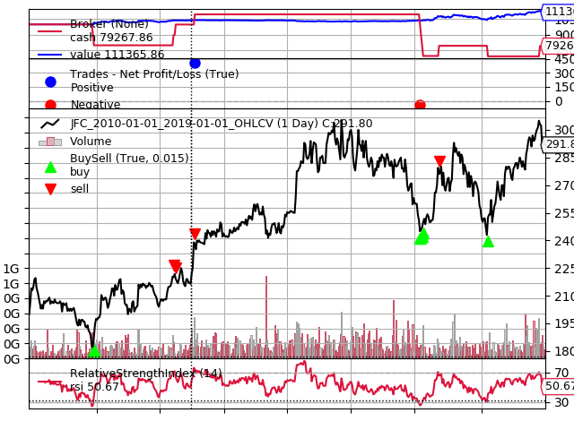
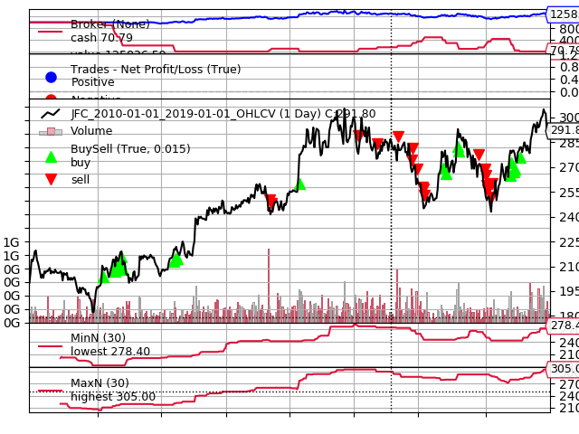

# psequant :nerd_face:
[](https://travis-ci.com/enzoampil/psequant)
[](https://github.com/ambv/black)
[](https://www.gnu.org/licenses/gpl-3.0)

**Easiest way to access and analyze Philippine stock data**

psequant (pronounced "see-kant") allows you easily access stock data from [PSE Edge](https://edge.pse.com.ph/) with as few as 2 lines of python code. It's goal is to promote data driven investments in the Philippines by making information accessible to everyone.

## Features
1. Easy access to Philippine stock data
2. Templates for backtesting trading strategies on Philippine stocks

## Setup
```
git clone https://github.com/enzoampil/psequant.git
cd psequant
virtualenv env
source env/bin/activate
pip install -r requirements.txt
```

## Get stock data from PSE
```
from psequant import get_pse_data
df = get_pse_data("JFC", "2018-01-01", "2019-01-01")
print(df.head())

#             open   high    low  close        value
#dt                                                 
#2018-01-03  253.4  256.8  253.0  255.4  190253754.0
#2018-01-04  255.4  255.4  253.0  255.0  157152856.0
#2018-01-05  255.6  257.4  255.0  255.0  242201952.0
#2018-01-08  257.4  259.0  253.4  256.0  216069242.0
#2018-01-09  256.0  258.0  255.0  255.8  250188588.0
```

## Plot data
```
from matplotlib import pyplot as plt

df.close.plot(figsize=(10, 6))
plt.title("Daily Closing Prices of JFC\nfrom 2018-01-01 to 2019-01-01", fontsize=20)
```


## Analyze with a Simple Moving Average Trading Strategy
```
ma30 = df.close.rolling(30).mean()
close_ma30 = pd.concat([df.close, ma30], axis=1).dropna()
close_ma30.columns = ['Closing Price', 'Simple Moving Average (30 day)']

close_ma30.plot(figsize=(10, 6))
plt.title("Daily Closing Prices vs 30 day SMA of JFC\nfrom 2018-01-01 to 2019-01-01", fontsize=20)
```


## Backtesting templates
Using the [backtrader](https://github.com/backtrader/backtrader) framework

### Relative Strength Index Strategy (14 day window)
Daily Jollibee prices from 2017-01-01 to 2019-01-01
```
python examples/jfc_rsi.py
```


### Min Max Support Resistance Strategy (30 day window)
Daily Jollibee prices from 2017-01-01 to 2019-01-01
```
python examples/jfc_support_resistance.py
```


## Run tests
```
pytest test_psequant.py
```
