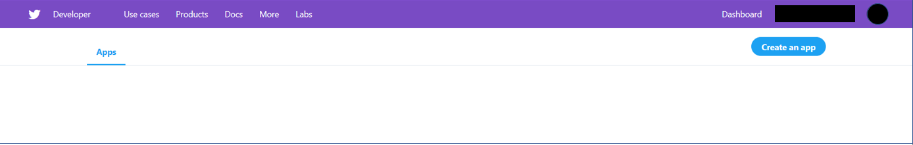
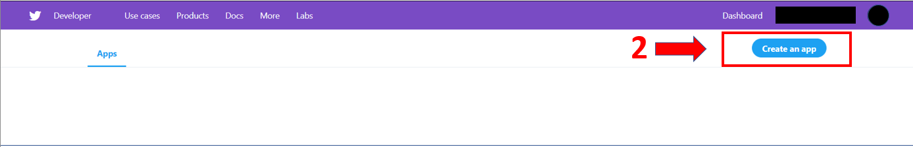
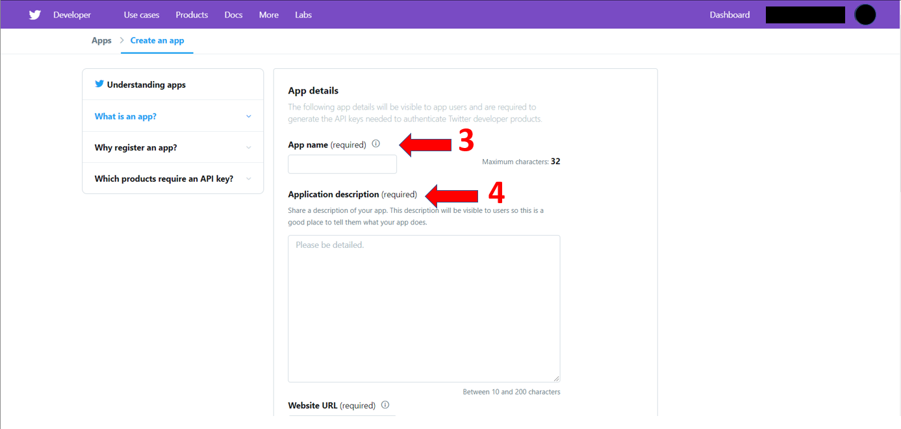
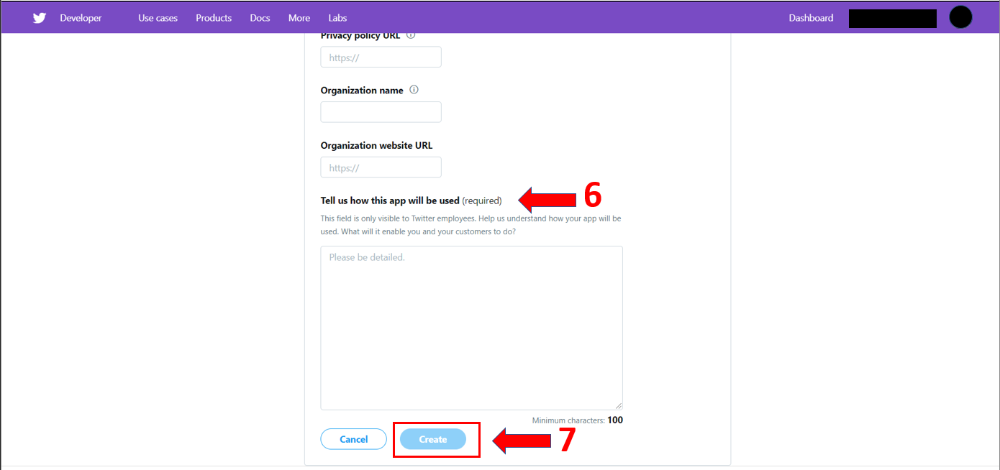
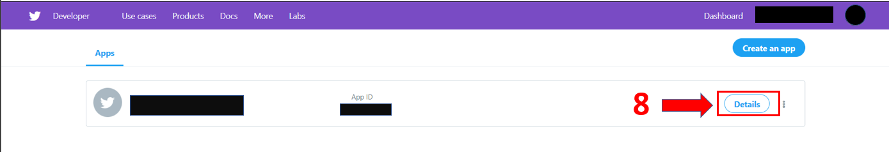
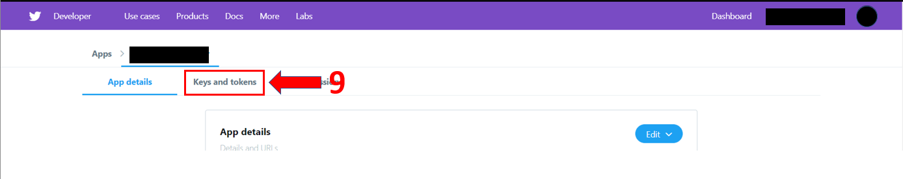
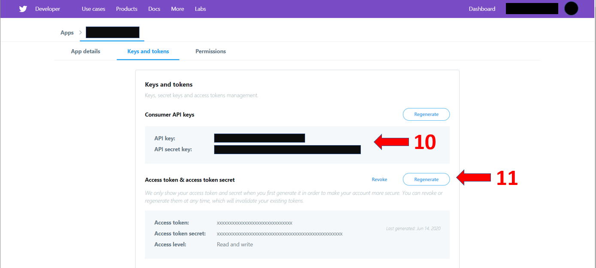

# Get Twitter API Credentials

In fastquant, there's a module called **get\_twitter\_sentiment()** wherein you specify a PSE stock symbol that you want to get tweet sentiments from and the list of twitter accounts you want to scrape tweets from. 

### Sample usage: 

```

twitter_sentiment = get_twitter_sentiment(stock_code, twitter_auth, start_date, twitter_accounts=None)

```

However, to do this, you need to get your own Twitter API credentials (twitter\_auth in the parameter) and authenticate it using the Tweepy library. 

Below is a guide on how to get your API credentials and how to authenticate them using fastquant.


Before anything, **please make sure that you have a Twitter account and are logged in**. Once done, please follow the steps below:

### Steps:

1. Go to [developer.twitter.com/en/apps](https://developer.twitter.com/en/apps)

 

2. Click **Create an App**

 

3. Please input your **App name**

4. Under **Application Description**, please write a short/brief description about your app 

 

5. For **Website URL**, feel free to write anything if you don't have any. (e.g. placeholder.com)

 

6. Feel free to skip the others, and go straight to **Tell us how this app will be used**. Write a short explanation of why you need to get Twitter API credentials.

7. Click **Create**

 


8. Go back to [developer.twitter.com/en/apps](https://developer.twitter.com/en/apps). Now, you must be seeing the app that you've created. Click on **Details**.

 

9. Navigate to **Keys and Tokens**

 

10. You should be seeing both your **API key** and **API secret key**. Save or secure both of these keys and remember where you saved them. 

11. Now, for your **Access tokens** and **Access token secret**, click **Generate** (or if you have already and you want to get a new one, click **Regenerate**). Same as the API keys, save or secure both of these tokens and remember where you saved them. *Note*: Regenerating new tokens will invalidate your existing tokens. 

 


*** 
### Authenticating your API credentials using Fastquant

Fastquant has a module named tweepy_api() which authenticates your API credentials.


#### Usage:
```

consumer_key = 'put_your_API_key_here'
consumer_secret = 'put_your_API_secret_key_here'
access_token = 'put_your_access_token_here'
access_secret = 'put_your_access_token_secret_here'

api = tweepy_api(consumer_key, consumer_secret, access_token, access_secret)

```

Now, that you have your api credentials authenticated, you can already try using the get_tweet_sentiment() module fastquant by passing the api object as twitter_auth in the parameter. 